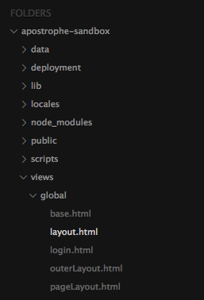
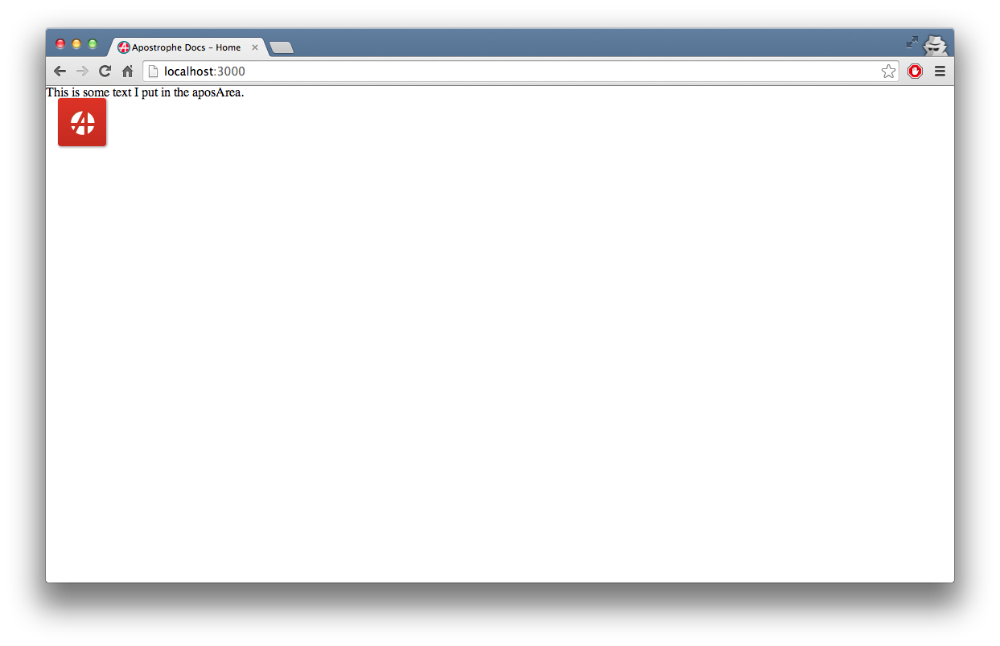
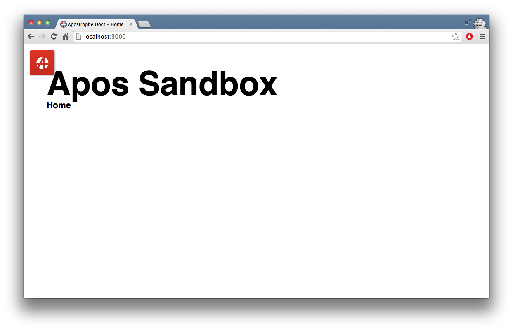
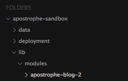

#Getting Started with apostrophe-sandbox

apostrophe-sandbox is an apostrophe server that has everything you need, where you need to get started quickly. Learn how to make you own apostrophe site from the beginning.

##Table of Contents 
*	[Set-up](#set-up)
	*	[Downloading and installing apostrophe-sandbox](#downloading-and-installing-apostrophe-sandbox)
 * [Server-side Setup](#server-side-setup)
 * [File clean-up](#file-clean-up)
*	[Gutting the pages](#gutting-the-pages)
	* 	[Layout](#layout)
	*  	[Home and other templates](#home-and-other-templates)
*	[Adding content](#adding-content)
	*	[Header for your homepage](#header-for-your-homepage)
*	[Adding style](#adding-style)
* 	[Adding a blog](#adding-a-blog)
	*	[Blog set-up](#blog-set-up)
 * 	[Making the blog](#making-the-blog)
 *  [Adding our posts to the homepage](#adding-our-posts-to-the-homepage)
* [Other resources](#other-resources)

##Set-up
###Downloading and installing apostrophe-sandbox
1.	You can download apostrophe-sandbox from Github by typing into your terminal:

		git clone https://github.com/punkave/apostrophe-sandbox.git 
2.	Once downloaded you can `cd` into the directory where you downloaded apostrophe-sandbox and type `npm install`. 

###Server-side Setup
1. Once you're done installing all of the modules, you can open your project. At the top, you should see something that looks like this:

  		root: module,
  		shortName: 'apostrophe-sandbox',
  		hostName: 'apostrophe-sandbox',
  		title: 'Apostrophe Sandbox',
  		sessionSecret: 'apostrophe sandbox demo party',
  		adminPassword: 'demo',
 *	You can leave `root: module` as it is but you'll want to change `shorName` and `hostName`. These can be whatever you want. They're there to specify what database your apostrophe site accesses. 
 * `sessionSecret` can be whatever you want. Just keep in mind that it's there for security purposes so if it's complicated, that's okay. *
 * Lastly, you should change `adminPassword`. This is the password you will use to log in to your apostrophe site. 

2.	With all this basic setup done, make your way down to the part of `app.js` that looks like this: 

		pages: {
    		types: [
      			{ name: 'default', label: 'Default (Two Column)' },
      			{ name: 'onecolumn', label: 'One Column' },
     		 	{ name: 'blocks', label: 'Blocks' },
      			{ name: 'marquee', label: 'Marquee' },
      			{ name: 'home', label: 'Home Page' },
      			{ name: 'blog', label: 'Blog' },
      			{ name: 'map', label: 'Map' },
      			{ name: 'groups', label: 'Directory' },
      			{ name: 'company', label: 'Company' }
    		]
  		},
As you may have guessed, this is where you specify all of the different page templates in apostrophe. The `name` is the name of the html file stored in `view/pages/`. Here, you can delete everything except for the home template that looks like `{ name: 'home', label: 'Home Page' }`.

###File clean-up
1.	Now that you've deleted all of the templates in `app.js` you need to delete all of them in the apostrophe-sandbox directory. Go into the `views/pages` directory in apostrophe-sandbox. You can delete the following files:
 *	 blocks.html
 *	 company.html
 *	 default.html
 *	 marquee.html 
 *	 onecolumn.html
 *	 sections.html

2. Finally, go into `public/css`. You can also delete the following files:
 *	blog.less
 * homepage.less
 * defaults.less
 * fonts.less
 * global.less
 * lockups.less
 * login.less
 * map.less
 * responsive.less
 * search.less
 * sections.less
 * templates.less

Now, you're ready to start working on the html and css for your apostrophe site.  

##Gutting the pages
If you run `node app` in your terminal now and try to log on to your site, you should get some errors. These are telling you that you're missing some files specified in `site.less`. `site.less` takes all of your css or less files and combines them into one, big css file. To fix this error, go into your `site.less` file and delete all of the lines that `@import` the less files that we deleted above. 

###Layout
Now take a look at the `layout.html` file in `views/global`. 
It looks like there's a lot going on in here but you can delete practically all of it. 
1. You should see  ``. You can delete everything inside this block. Make sure not to delete the `` that corresponds with our header block. 

2. You can delete the breadcrumbs block all together if you want, even the block itself. You should delete everything inside `` just like we did with the header block. Again, don't delete the blog itself, just the content inside. 

3. You can delete the extra content block all together as well as everything inside ``. You could leave `` and delete everything inside of it. It's just a matter of how you want to organize your template. You can also add or delete blocks later if you need to. 

At this point, you should just see a collection of nunjucks blocks in your `layout.html`. Now, we can go over what all of these sections are. 

###Home and other templates
Later, when you go into `home.html`, you'll see that the first line is a nunjucks line: ``. As you may already know, this means that `home.html` can access all of the nunjucks blocks inside of `layout.html`. Let's say you want a header that is common to all pages on your apostrophe site. If you have all of your templates extend layout, you can do that really easily. Now let's say you want to have the same header on all of your pages except for the homepage. You still have all of the pages (including `home.html`) extend `layout.html`. You would put `` in your `home.html` to override whatever the header is in `layout.html`.  Using these blocks is a way of easily managing content across all of your pages. 

Now, go into `home.html` and delete all of the content inside the hero and mainContent blocks. 

##Adding content

###Header for your homepage
Now lets create a simple homepage. Let's have the header on the homepage be different from every other page. As I said before, this means we'll override the header block in `layout.html` by adding a header block of our own inside `home.html`. I've created the beginnings of my homepage header:

	
 		

    		<h1>{{ aposArea(page, 'siteTitle') }}</h1>
    		

     	 		<ul>
        			<li>
        			</li> 
      			</ul>
    		

  		

	
I'm sure the thing that stuck out to you and possible confused you was `<h1>{{ aposArea(page, 'siteTitle') }}</h1>`. `aposArea` is apostrophe for regular text. It will be editable when you log in to your apostrophe site. We also passed two parameters to this nunjucks function: `page` and `siteTitle`. `siteTitle` is the name of the `aposArea`. By giving it a name it won't get confused with any other `aposArea` so that text you put in one `aposArea` won't show up in another. The name can be whatever you want but considering that this piece of text was going to hold the site title, it felt appropriate that I call the `aposArea` siteTitle. The `page` parameter means that this text is specific to the page it's on. In other words, if you were to make an `aposArea(page, 'siteTitle')` on a different page, they won't get confused. 

Now, let's start up our site to make sure the changes we've made are reflected in the browser. 

I know, that doesn't look like much of a header for our site, but we'll style it soon. Now let's work on our navbar.
	
	

      <ul>
        <li><a href="/">Home</a></li> 
        
          <li><a href="{{tab.slug}}">{{tab.title}}</a></li>
        
      </ul>
    

In a apostrophe, we've got an object called page with a property called tabs. We can loop through `page.tabs` like I did above with some nunjucks to list all of pages in the navbar. The problem is that all pages are children of the home page by default. This means that the home page won't be accounted for in page.tabs, which is why I added it above. 

Now we've got a really basic header. Let's start styling it. 

##Adding style 
Now we can style our header a little bit. We don't have a less file for our homepage yet, so first, let's create one. In `public/css` I added a file called `home.less`. In order for our new less file to work, we need to add `@import 'home.less;` into our `site.less` file. Now we can add to `home.less`. 

	.header {
		width: 90%;
		height: 400px;
		margin: 5% auto;
		h1 {
			font-size: 5em;
			font-weight: 700;
			font-family: sans-serif;
		}
		.nav {
			ul {
				li {
					display: inline-block;
					a {
						font-size: 1.3em;
						font-family: sans-serif;
						color: black;
						font-weight: 600;
						text-decoration: none;
						line-height: 1.3em;
						&:hover {
							text-decoration: underline;
						}
					}
				}
			}
		}
	}
Now are page looks like this:

To populate our homepage, we could create a blog and have our homepage display some of the most recent posts. 

##Adding a blog

###Blog set-up
To add a blog, we need to add an `apostrophe-blog-2` folder in our project, specifically, right here: 
Inside that we'll add a `views` folder. Finally, inside the views folder add `index.html` and `show.html`. `index.html` will show us all of our blog posts and `show.html` will be the page with the actual blog post on it as well as the place you will go to when you want to edit the blog post. 

Have both the `index.html` and `show.html` pages extend `layout.html`. Now, we have to add our new template(s) to `app.js`. Now the pages section of our `app.js` should look like this: 

	  pages: {
     	types: [
      		{ name: 'home', label: 'Home Page' },
      		{ name: 'blog', label: 'Blog'}
    	]
  	}, 

Don't worry that we have our `name` set to `blog`. Apostrophe will know where to look for your blog. I'm also going to add a `summary` field to the blog module that I can put on the front page so people can see what each post is about. 
	
	//In modules
	 'apostrophe-blog-2': {
		pieces: {
			addFields: [
        		{
          			name: 'summary',
          			type: 'string', 
					textarea: true,
        			label: 'Summary'
        		}
      		]
		}
   	},

###Making the blog
Now let's add some markup to our `index.html` first. From `index` we can access an object called `pieces` that holds all of our blog posts. To list all of our blog posts out, I added this to the `index.html` page: 

	<ul>
		
			<li>
				<a href="{{ piece.slug }}"><b>{{ piece.title }}</b></a>
				{{ piece.summary }}
			</li>
		
	</ul>
You can add the title of the page above this if you want with `{{ page.title }}`. 
On 	`show.html` you can add the post title by accessing `{{ page.title }}` once again. To be able to add content to the post, I just added an `aposArea`.
###Adding our posts to the homepage
You can see that we have access to the pieces object on the index page of apostrophe-blog-2. Unfortunately, we don't have access to this object on the homepage. So, how do we get all those posts on the homepage like we want? We use widgets.

1. Add `widget.html` and `blogMacros.html` to the `views` folder of the apostrophe-blog-2 module that we added. 
2. Edit `blogMacros.html` to give the widget we'll be making the content you want (using nunjucks macros):
	*	We're going to have two macros, one to render the blog post:

			
				<a href="{{piece.slug}}"><li>
					<b>{{piece.title}}</b>
					
{{piece.summary}}

				</li></a>
			
Notice that we need to add a parameter to `renderBlogPost` called `piece`. This is because we can't access our pieces object from `blogMacros.html`.
 * And one to get the blog posts in a list:

			
				<ul>
					
						{{ renderBlogPost(piece) }}
					
				</ul>
			
Notice (again) that we need to add a parameter to `renderBlogPosts` called `pieces`. This is *also* becaue we can't access our pieces object from `blogMacros.html`.
3. Go into `widget.html` and add:

		

		{{ renderBlogPosts(item._pieces) }}
From `widget.html`, you can see we can finally access our pieces object (although slightely differently from the way we access it in `index.html`). Just remember that you **have** to pass `item._pieces` to your macro with an underscore before pieces. 
4. Finally, we can add the widget to our homepage. Go to `home.html` in our `views` folder. Adding a widget like the one we made is easy. Just add a singleton that looks like this: `{{ aposSingleton(page, 'archive', 'blog') }}` The second argument we pass to `aposSingleton` is the name of the singleton, and the last value we pass is the type of singleton. You'll see an Apostrophe singleton pop up on your homepage. 

##Other resources
Now you have a basic understanding of the architecture of apostrophe-sandbox as well as the syntax to add different types of editable content. However, there's a lot we didn't cover so before you try to figure something out on your own take a look at the rest of the apostrophe documentation: 

*	[Apostrophe Now](http://apostrophenow.org)
*	[Apostrophe](http://github.com/punkave/apostrophe)
* 	[Apostrophe Blog 2](http://github.com/punkave/apostrophe-blog-2)
*  [Apostrophe Snippets](http://github.com/punkave/apostrophe-snippets)
*  [Apostrophe Map](http://github.com/punkave/apostrophe-map)
*  [Apostrophe Events](http://github.com/punkave/apostrophe-events)
*  [Apostrophe Schemas](http://github.com/punkave/apostrophe-schemas)
*  [Apostrophe Blocks](http://github.com/punkave/apostrophe-blocks)
*  [Apostrophe Twitter](http://github.com/punkave/apostrophe-twitter)
*  [Apostrophe Facebook](http://github.com/punkave/apostrophe-facebook)
*  [Apostrophe Tumblr](http://github.com/punkave/apostrophe-tumblr)

	

